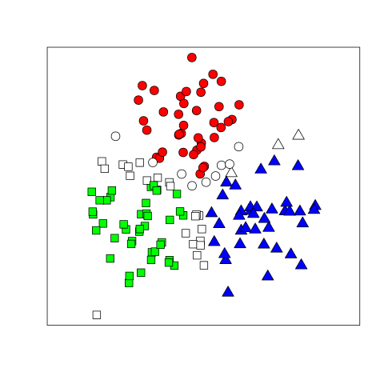

CORECLUSTER
===========

The `corecluster` R-package provides an implementation of the method described in

_Henelius, Andreas; Puolamäki, Kai; Boström, Henrik and Panagiotis Papapetrou. Clustering with Confidence: Finding Clusters with Statistical Guarantees. 2016._ The paper can be found [here](https://arxiv.org/abs/1612.08714).

The basic idea is to find stable clusters in the data by considering co-occurrences of data items in multiple clustering solutions obtained, e.g., by bootstrapping a dataset.

Citing
------
To get a BibTex entry in R type `citation("corecluster")` when the package is installed.


Installation from GitHub
-----------------------
The development version of the `corecluster` package can be installed from GitHub as follows.

First install the `devtools`-package and load it:
```
install.packages("devtools")
library(devtools)
```

You can now install the `corecluster` package:
```
install_github("bwrc/corecluster-r")
```


Examples
---------
This is a short example demonstrating use of the library.
We here consider the clustering of a synthetic dataset with 150 data items, divided into three classes.

```R
## Load library
library(corecluster)

## Generate some synthetic data
N         <- 150
n_cluster <- 3

set.seed(42)
dataset_synthetic <- get_dataset_synthetic(N = N)

## Define clustering functions
## A clustering function is defined such that it takes
## one argument (the data) and returns a vector of
## cluster IDs.
##
## As an example, to use the k-means algorithm we define
clusterfunc_kmeans   <- function(x) { kmeans(x, centers = n_cluster)$cluster }

## Perform clustering
res <- make_experiment(dataset             = dataset_synthetic,
                           clustering_func = clusterfunc_kmeans,
                           sampling_func   = NULL,
                           alpha           = 0.1,
                           n_iter          = 1000,
                           method          = "bootstrap",
                           save            = NULL)

## Visualise results
plot_result(res, savename = "/tmp/data_synthetic.png", plot_format = "png")
```
This produces the following figure, in which the three core clusters are shown in different colors (red, green and blue) and the so-called weak points are uncoloured.


License
-------
The `corecluster` R-package is licensed under the [MIT-license](http://opensource.org/licenses/MIT).
